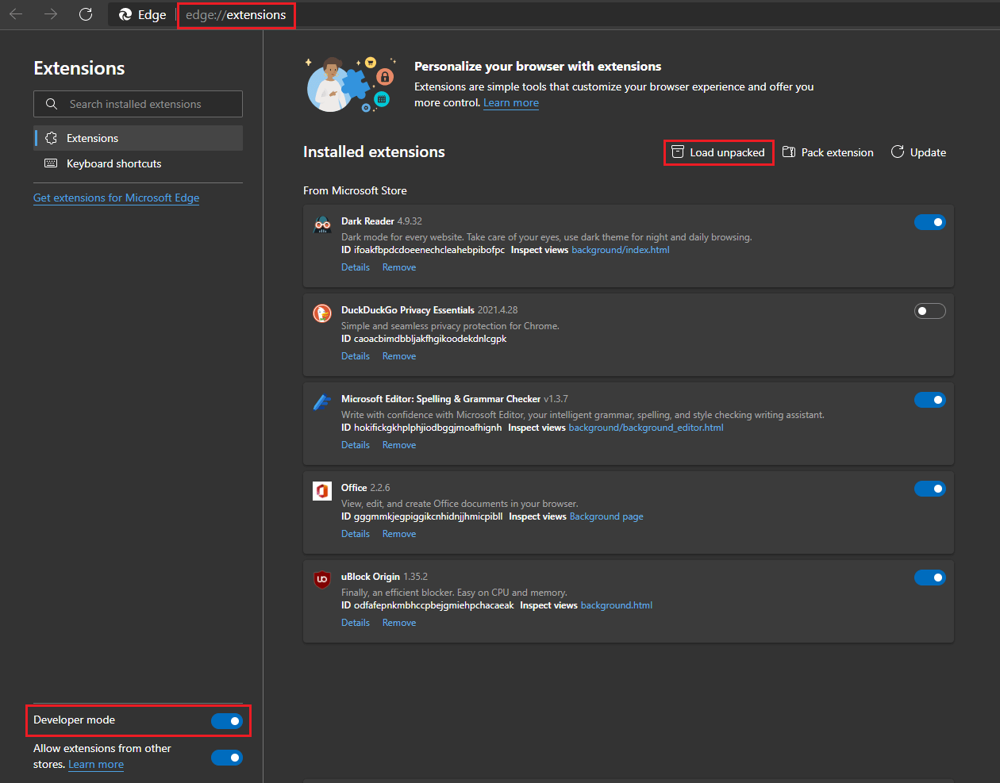

<h1 align="center">Welcome to Youtube Volume Scroll 👋</h1>

  
  
   

>  Chromium Extension that enable scrolling mousewheel to control volume on Youtube and Youtube Music
 
### 🏠 [Homepage](https://github.com/Araxeus/Youtube-Volume-Scroll#welcome-to-youtube-volume-scroll-)

 

### Features

★ Use mousewheel on the video to change the volume

★ Display the new volume for 1 second on the video when changing volume

★ Remember volume even in incognito mode

★ Works in embedded videos

★ Clicking the extension [icon](https://user-images.githubusercontent.com/78568641/152661730-3b6be926-a163-47d8-a337-ddd929183317.png) allows Changing the volume scroll 'steps'

★ Automatically blocks the ["Continue watching?" popup](https://user-images.githubusercontent.com/61631665/129977894-01c60740-7ec6-4bf0-9a2c-25da24491b0e.png) that appears after some time

## Usage

1. Install from the [Chrome Web Store](https://chrome.google.com/webstore/detail/youtube-volume-scroll/agadcopafaojndinhloilcanpfpbonbk) or as unpacked extension
2. Use Mousewheel on the video player on [youtube.com](youtube.com) or [music.youtube.com](music.youtube.com)

## Standalone install (unpacked extension)

* Download [the latest release](https://github.com/Araxeus/Youtube-Volume-Scroll/releases), 
  > or clone the repo, optionally install [sass](https://sass-lang.com/install) and build yourself using either:
  > * `.\zip.ps1` \ `zip_windows.bat` - need to [have powershell 7+ installed](https://docs.microsoft.com/en-us/powershell/scripting/install/installing-powershell) (from cmd `pwsh -f zip_release.ps1`)
  > * `zip_linux-mac.sh` - if you are on mac |OR| linux and have [`zip`](https://linux.die.net/man/1/zip) installed via your package manager
  > * if you don't care about the extra 10kb you can instead just download the [unpacked](unpacked) folder
* Extract the files to a folder
* Load that folder as an unpacked extension in your chromium browser

 

<b>Chrome Example</b>

 

  
<b>Edge Example</b>

## Known Issues

* To work in incognito, permission needs to be explicitly set in the [extension settings](https://user-images.githubusercontent.com/78568641/155850125-4b98e01c-f55d-4747-89c5-25ecd792f025.png)

* If you experience embedded videos in incognito mode not saving volume: 
  disable `Block third-party cookies in incognito` ([1](https://i.stack.imgur.com/mEidB.png)/[2](https://user-images.githubusercontent.com/78568641/155840831-d3cb8fa8-4d17-457a-944e-638a813600d7.png))

## Author

👤 **Araxeus**

* Github: [@Araxeus](https://github.com/Araxeus)

## 🤝 Contributing

Contributions, issues and feature requests are welcome! Feel free to check [issues page](https://github.com/Araxeus/Youtube-Volume-Scroll/issues). 

## Show your support

Give a ⭐️ if this project helped you!
