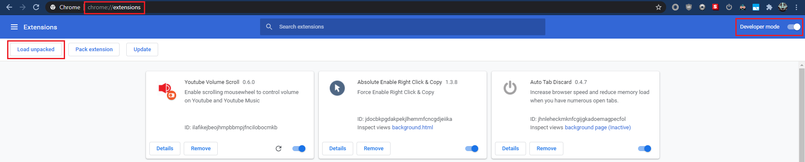
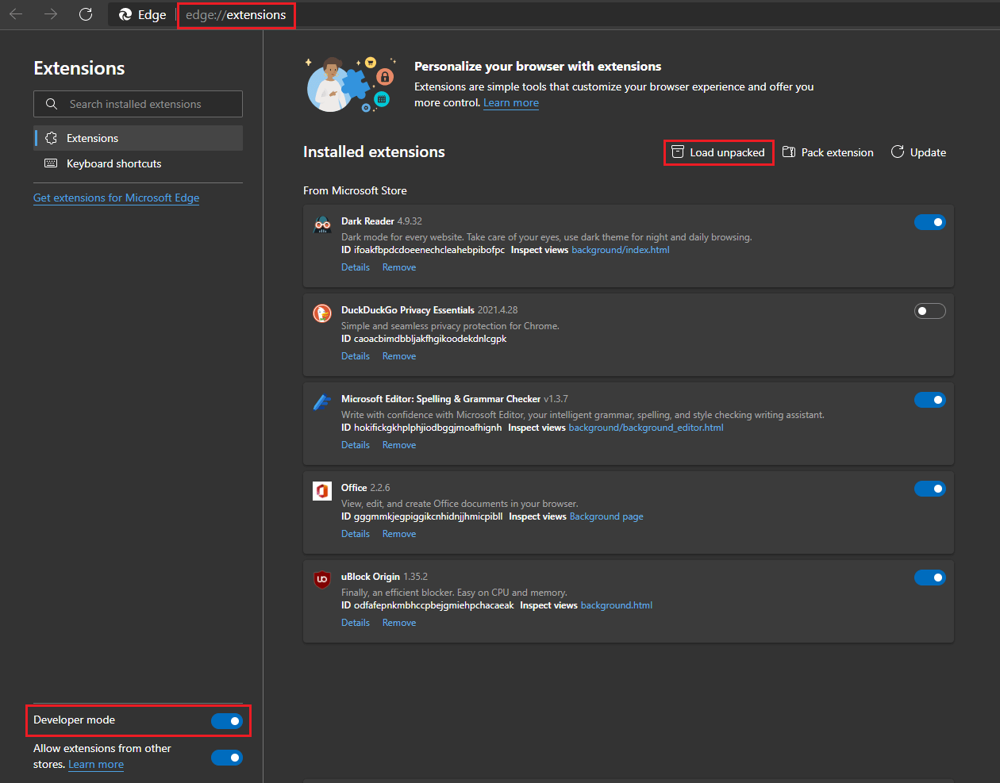

<h1 align="center">Welcome to Youtube Volume Scroll 👋</h1>

  
  

>  Chromium Extension that enable scrolling mousewheel to control volume on Youtube and Youtube Music

### 🏠 [Homepage](https://github.com/Araxeus/Youtube-Volume-Scroll#welcome-to-youtube-volume-scroll-)

Sadly it cost 5$ to publish an extension to chrome webstore.
Meanwhile you can install this as unpacked extension

## Install

Download the latest release and load as unpacked extension in your chromium browser

#### Chrome Example:

#### Edge Example:

## Usage

Use Mousewheel on the video player in [youtube.com](youtube.com) or [music.youtube.com](music.youtube.com)

## Author

👤 **Araxeus**

* Github: [@Araxeus](https://github.com/Araxeus)

## 🤝 Contributing

Contributions, issues and feature requests are welcome! Feel free to check [issues page](https://github.com/Araxeus/Youtube-Volume-Scroll/issues). 

## Show your support

Give a ⭐️ if this project helped you!
